# Notas de GitHub
 Fuentes URL's:
1. [certificacion-github-foundations-temario-completo-y-examen](https://www.udemy.com/course/certificacion-github-foundations-temario-completo-y-examen)

# Primeros pasos
## 00 - Instalaciones

   Deberemos instalar 2 cosas principalmente:

   1. Git, de la página oficial [www.git-scm.com](https://git-scm.com/downloads) en nuestro navegador.

      1. **NOTA IMPORTANTE :** NO seleccionar VIM como editor de Git.

      2. Es mejor elegir Visual Studio Code, aún cuando no lo tengamos instalado todavía.
      ![alt text][def]

      3. Hay otro paso donde nos pide cambiar el nombre de la rama principal de Master a `main`, o lo que querramos. Elegir esa casilla.

   2. Y el IDE [Visual Studio Code](https://code.visualstudio.com/download)

## 01 - Creación de una cuenta en GitHub, en línea.

   1. Entermos a la página de GitHub y únicamente con un Email podemos crear una cuenta.
   2. Entremos en el enlace [https://github.com/settings/emails](https://github.com/settings/emails) y busquemos dos datos importantes:
      1. Nombre de usuario
      2. Email

![img.png][def2]

## 02 - Abrir el Directorio, Fichero o Carpeta de los archivos a respaldar.

Ya sea que creemos una carpeta nueva, o sencillamente nos dirigimos a una que ya contenga archivos de interés.

1. Clic derecho > `Open Git Bash Here`
2. Teclear: `git init`
o
2. Clic derecho > Mostrar mas opciones > `Abrir con Code` (Visual Studio Code)
   1. Dar clic en el ícono de `Source Control`
   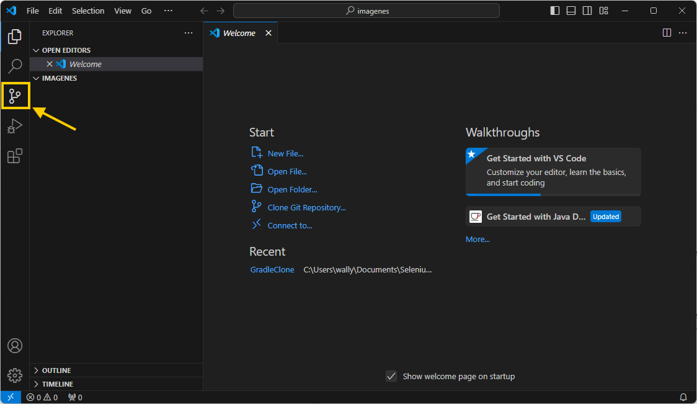

   2. Clic en `Initialize Repository`
   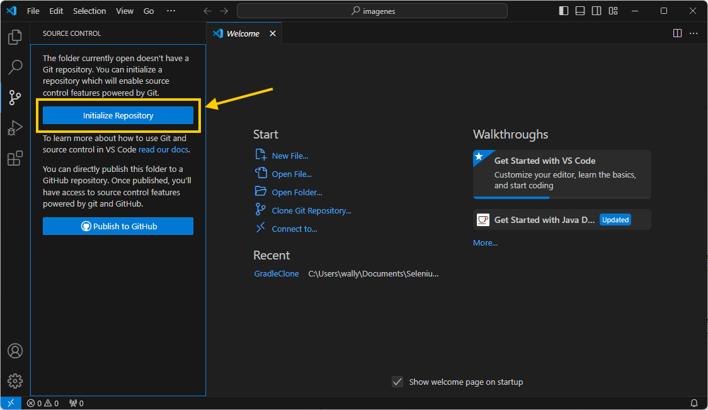

   3. Abrir la Terminal en VSC.
   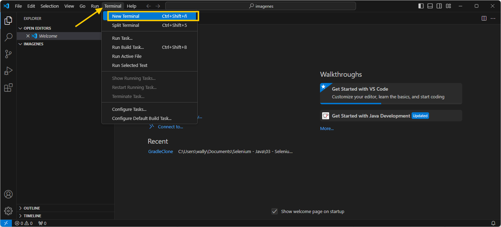
      1. Debe ser la BASH
      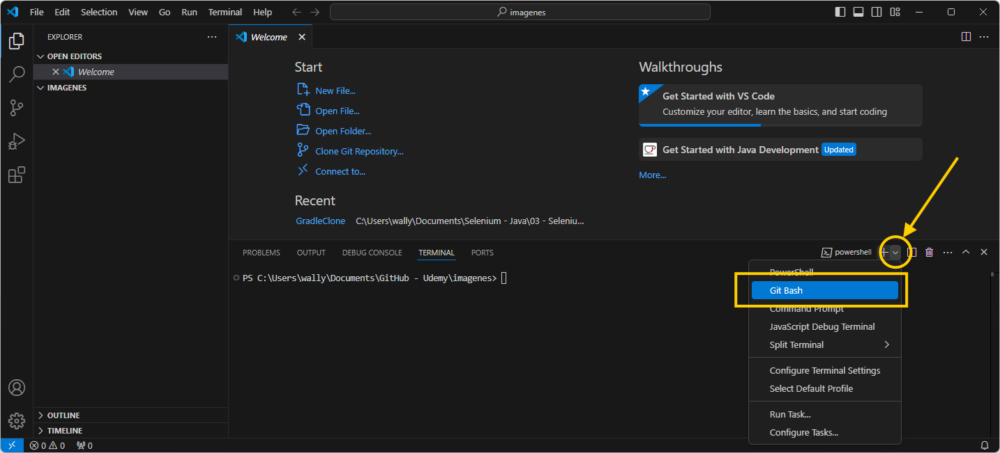

      2. La terminal BASH se caracteriza por ser colorida:
      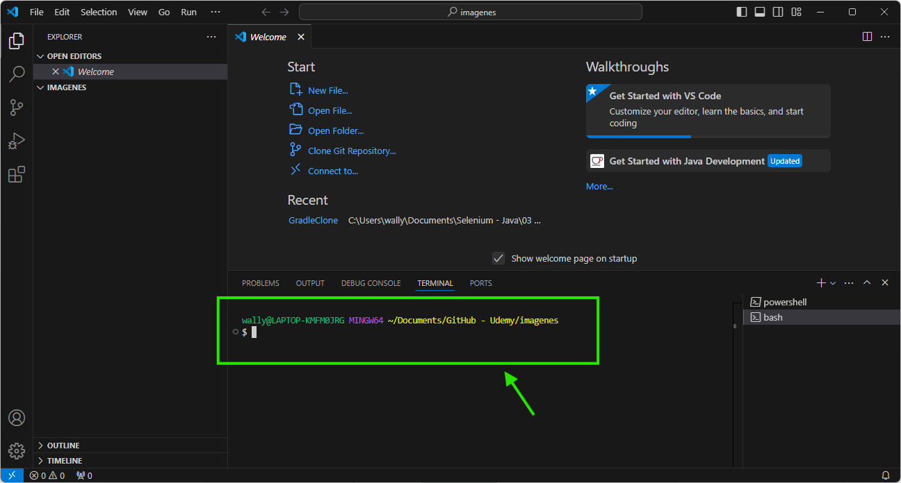

## 03 - Configuración de Git, local, desde la terminal BASH.

Debemos sincronizar la información de usuario del Repositorio en línea `GitHub`, con nuestro sistema de control de versiones local `Git`.

La información de `Nombre` e `Email` se debe configurar los datos del usuario reflejando los datos del Repositorio de GitHub.

Debemos teclear los datos manualmente:

>     git config --global user.name "qa-gvazquez"
>     git config --global user.email "wally_slug@hotmail.com"

Para verificar que se aplicaron los cambios, en la Terminal `Bash` debemos teclear:

>     git config --global -e

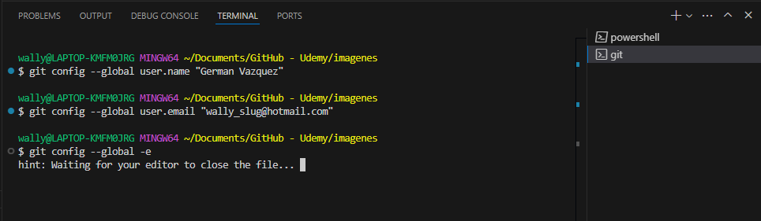

Se abrirá una ventana nueva en el editor por defecto (Debería se Visual Studio Code, si hicimos bien la instalación de Git) con el archivo `.gitconfig` donde se enlistan los ajustes de `Git` local. 

Sencillamente cerramos la ventana.

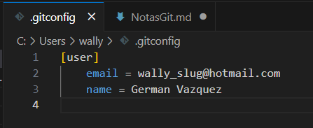

También podemos hacer lo mismo con una sola línea de comando
>     git config --global -l

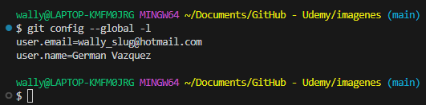

## 04 - Creando un nuevo Repositorio en GitHub, en línea.

Una vez en nuestra cuenta de GitHub, tendremos muchas opciones para crear un Nuevo Repositorio, o un espacio en la Web para compartir nuestro proyecto.

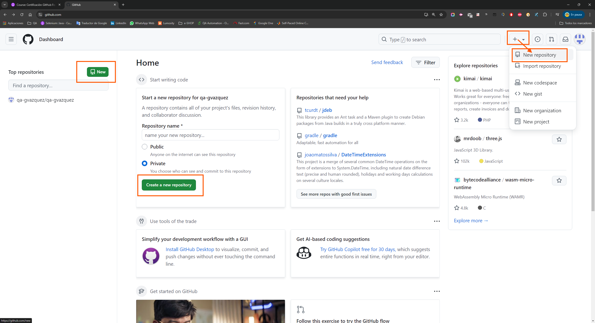

Únicamente, debemos colocar un nombre al Repo, sin espacios.

También, elegir si debe ser `Público` o `Privado`

y dar clic en `Create repository`

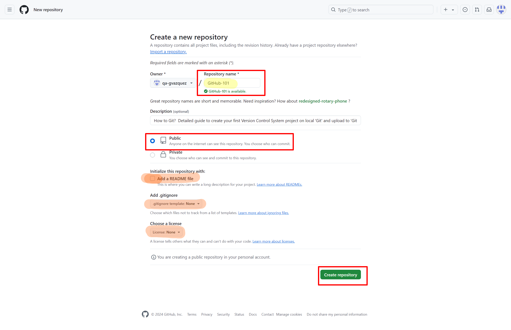

## 05 - Subiendo el proyecto a un Repositorio

1. Si no lo hemos hecho aún, debemos abrir la carpeta de los archivos a respaldar, e inicializar el proyecto Git (local) con el comando:
>     git init
Esto ya se hizo en un paso anterior, pero podemos comprobar que nuestra carpeta está siendo monitoreada, con el comando:
>     ls -al
que enlista todo el contenido de nuestra carpeta, deberíamos poder ver una carpeta oculta llamada `.git` que contiene los archivos del sistema de control de versiones.

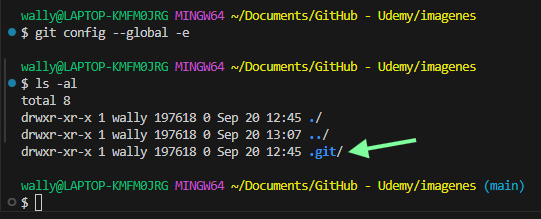

2. Debemos comenzar a monitorear los cambios (versiones) realizados a nuestro proyecto.
>     git status
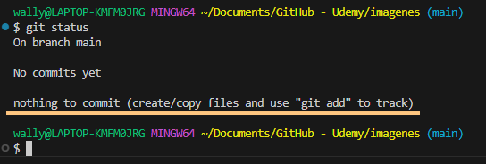

En este caso, como la carpeta está vacía, no hay nada que monitorear.

Creamos 2 archivos de prueba, para tener un cambio después de haber inicializado el sistema de control de versiones.

En la barra de herramientas vertical de Visual Studio Code (`VSC o Code`) seleccionamos el `Explorer`y luego el ícono de `New File'

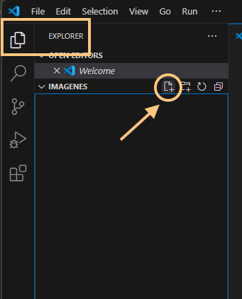

Se crean 2 archivos de texto, como ejemplo, pero deberíamos tener los archivos a trabajar. El objetivo es tener 'algo' que monitorear.

>     NOTA: Git en VSC y GitHub se destacan en el control de cambios de archivos de TEXTO, pero podemos gestionar los cambios de cualquier tipo de archivos.

Como ya tenemos una 'diferencia' desde que inicializamos el proyecto, VSC nos apoya visualmente con marcadores para indicar que tenemos archivos 'nuevos' en el `WorkSpace` sin 'rasterar'.

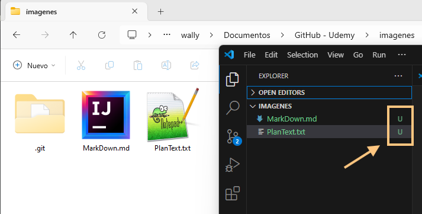

Ahora, debemos especificar que SÍ queremos que se guarden estos cambios.

Hay 2 maneras:

1. Individualmente cada archivo `Cherry Pick`con el comando:
>     git add Mar + TAB
Esto, nos ayuda a autocompletar el nombre del archivo individual, pero debemos repetirlo con el otro
2. Todos dentro de la carpeta del proyecto:
>     git add .

Ahora, el indicador visual cambió a `Index Added` e incluso en la carpeta misma, el ícono ha cambiado para identificar esos archivos como 'monitoreados'.

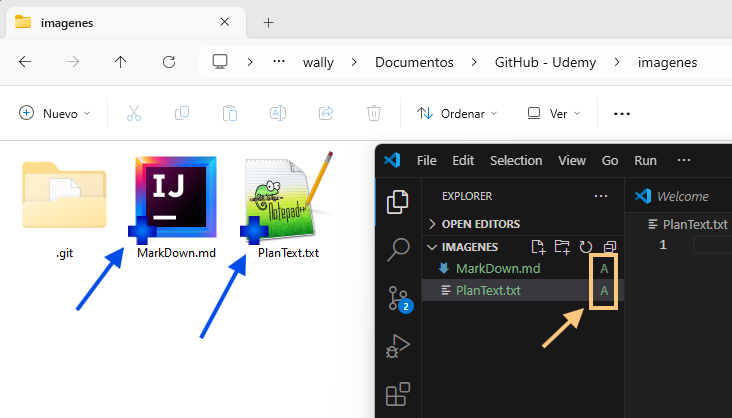

Volvemos a  monitorear los cambios (versiones) realizados a nuestro proyecto.
>     git status

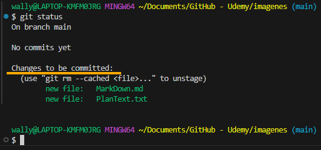

Esto significa que nuestros cambios están en el `Staging Area`, es decir ,que ya están listos para ser agregados a la siguente 'version' o ser guardados en el sistema de contro de cambios.

Esta versión guardada, o estado, se denomina `Commit` y es el principal elemento del sistema de control de versiones de Git.

Como tal, el `Commit` es un punto de restauración que se identifica con un ID único, denominado `HASH`, y require de una breve descripción de los cambios realizados desde la última vez que se guardaron.

En este caso, es la primera vez que los guardamos, y escribimos el comando:

>     git commit -m "first commit"

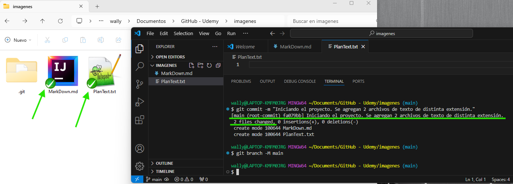

A continuación, homologamos el nombre de la rama principal de nuestro Git local, con el que utiliza GitHub.

Generalmente, Git lo nombra `MASTER`y GitHub le denomina `MAIN`.

Hacemos ese cambio de nombre en nuestro repositorio local con el comando:
>     git branch -M main

Aunque, si configuramos correctamente Git en la instalación, esto ya debería llamarse así.
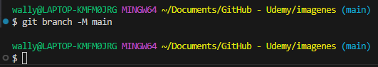

>**Así se vería el cambio de nombre de la rama principal**
>
> 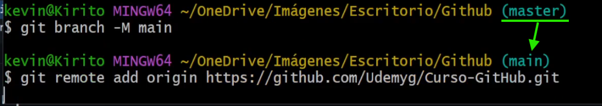

**NOTA:**

Para el caso de tener que renombrar una Rama en GitHub, es así:

[Fuente - Renaming a Branch in GitHub](https://docs.github.com/es/repositories/configuring-branches-and-merges-in-your-repository/managing-branches-in-your-repository/renaming-a-branch)

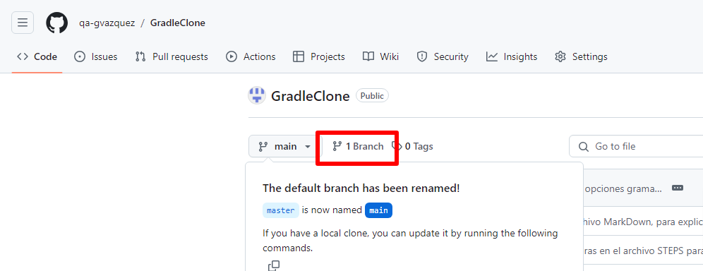

Luego

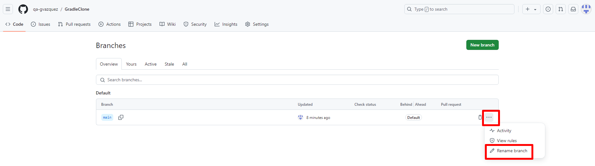

Después:

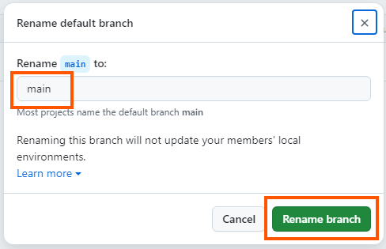

Finalmente, definimos en la configuración de nuestro repositorio local GIT, la dirección URL de nuestro repositorio en línea GITHUB, para que todos los cambios puedan ser compartidos con el mundo. El comando es:

>     git remote add origin https://github.com/qa-gvazquez/GitHub-101.git

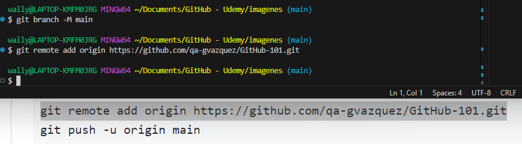

Y, para cerrar con Broche de Oro, finalmente subimos los cambios:
>     git push -u origin main

Y, falla por que teníamos registradas las credenciales de otro usuario de GitHub.. La solución está en otra sección de este documento.

Una vez corregido el detalle, volvemos a ejecutar el comando 
>     git push -u origin main

Y la extensión de GIT preinstalada en Visual Studio Code, nos abre la ventana de conexión a GitHub:

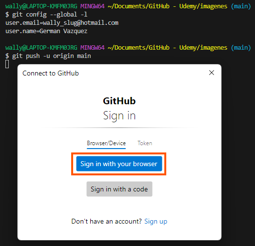

Elegimos el navegador en el que ya tengamos abierta la sesión de GitHub, y elegimos la siguiente opción:

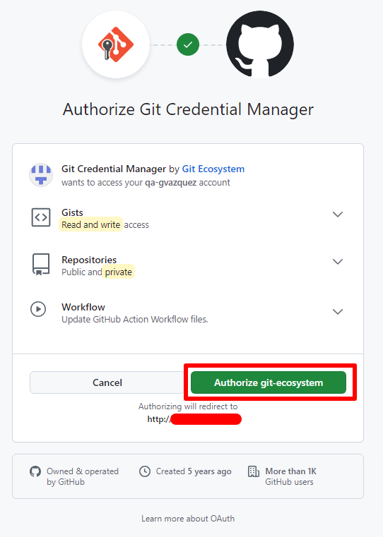

Finalmente, debemos teclear nuestra contraseña de la cuenta de GitHub y dar clic en `Confirm`.

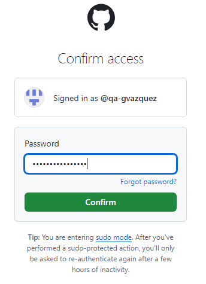

En la terminal de Bash en VSC aparecerá el siguiente mensaje:

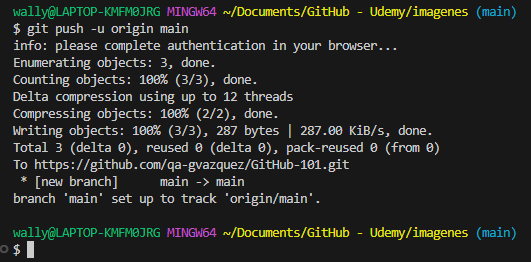

Debemos cerrar la ventana del Navegador, y refrescar la ventana del Repositorio Remoto, donde aparecen los pasos a seguir para este proceso:

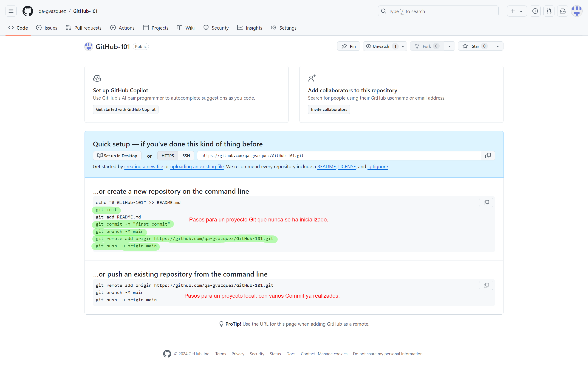

Finalmente, podemos ver nuestros cambios en la Web, a disposición de todo el mundo para compartir nuestros conocimientos y respaldar nuestros avances.

## 06 - Solucionando errores de GitHub.

El error, es que ya teníamos configurado anteriormente un Usuario de GitHub, que tenía otra URL para subir cambios a otro Repositorio.
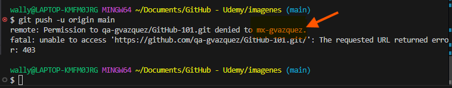

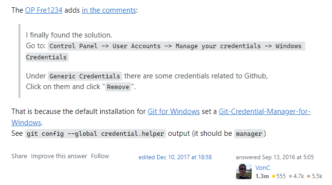

[Source](https://stackoverflow.com/questions/39422521/how-can-i-change-the-user-on-git-bash)

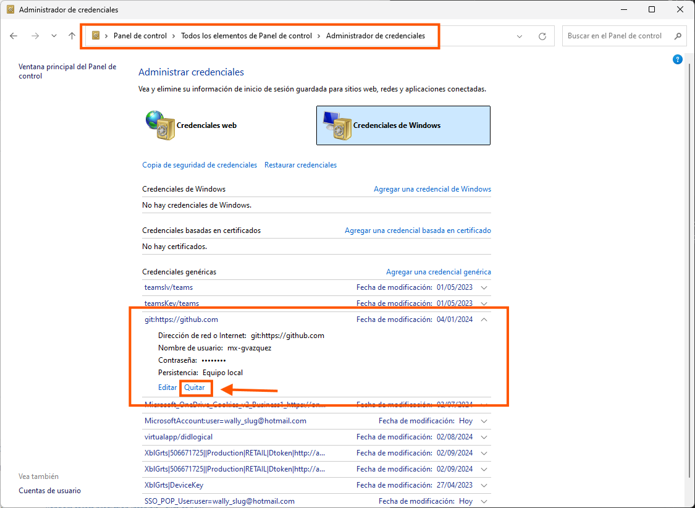

Con este 'reset' al Administrador de Credenciales, podemos continuar.

[def]: ./images/image.png "Seleccionar Visual Studio Code"
[def2]: ./images/img.png "Vista Previa de GitHub"
